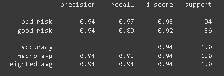

# Informe

## Descripción del flujo de trabajo

El flujo de trabajo consiste en los siguientes pasos:
1. Leer el CSV con Lazyframe y planear llenar los espacios vacíos
2. Planear agregarle al dataset (Lazyframe) 2 características adicionales para otorgarle al LLM más contexto (ratio deuda/ahorro y pagos mensuales)
3. Pasarle al LLM el dataset por batches al API para que procese varios registros en simultaneo y se hacen consultas en simulateno para que sea aun más veloz. El LLM, en este caso Nova Lite, crea la descripción y también clasificia al cliente.
4. Se guarda el dataset con descripcion y target en el S3
5. Se preprocesa el dataset para que este listo para ser utilizado para el entrenamiento y testeo (OHE, NE, SMOTE). Se guardan las variables temporalmente que seran de utilidad para el train_model.py.
6. Luego de que ya se equilibro el dataset, llamando al script train_model.py se entrena al modelo, se calculan los hiperparametros y se queda con la mejor versión.
7. Se guarda la mejor versión en el S3 para su posterior uso.
8. Se despliega en SageMaker, creando su imagen y endpoint para consultas.

## Explicación de decisiones técnicas

**Contexto**:
- Se realizaron en local distintas pruebas de modelos (XGBOOST, LightBoom, CATBoost, RandomForest, RegresionLogisticas) reduciendo dimensiones, incrementando caracteristicas antes o despues de que se genere la descripción.
- Se probaron distintos enfoques de enviar la información al LLM:
    - Enviar el dataset poco a poco al LLM de manera asincronica (LLM + Finbert + Lazyframe) 
    - Enviar el dataset con batches grandes al LLM de manera asincronica (LLM + Finbert + Lazyframe)
    - Enviar todo el dataset con batches al LLM de manera asincronica ( LLM + Lazyframe)
- Se probo emplear **FinBERT** y contrapartes finetuneadas en local para procesar las descripciones otorgadas por el LLM (+20 minutos) en contraparte de usar netamente el modelo LLM para describir y clasificar (1-3 min)

Dada las pruebas y la investigación realizada para llevar a cabo el desafío se decidieron usar estas tecnologías:
- **Nova Lite**: Presenta una ventana de contexto amplia evitando que se pierda información, un modelo barato y rápido.
- **Polars**: Tiene mejor rendimiento que Pandas, similar integración con librerias existentes y permite usar Lazyframes, para evitar cargar todo de golpe en la memoria. Esto último es útil si el dataset es muy grande.
- **BayernSearch**: Se consultaron papers y se encontro uno que "indentificaba fraudes de transacciones" utilizando XGBOOST empleando GridSearch, SMOTE y BayernSearch. Donde la combinación de los dos últimos le daba el mejor rendimiento por hacer una búsqueda inteligente de hiperparametros (los dataset empleados eran de más de 100k registros) - Nombre del paper: **A novel approach based on XGBoost classifier and Bayesian optimization for credit card fraud detection.** 
- Vectorizar las descripciones: Con **TF-IDF** se vectorizan las descripciones para aprovechar esa estructura que dio el LLM y las relaciones que determino gracias al prompt, la información brindada y el conocimiento que tiene.
- Se uso la **API Converse** para interactuar con el LLM, no mediante la UI.
- **SMOTE**: Debido a que el dataset presentaba más "good risk" se equiparo las proporciones para un entrenamiento más preciso
- Se decidió llenar los espacios en con "no info" las Saving account y Checking account dado a que se quiso considerar como si las personas no estaban totalmente "en el sistema financiero"
- En unas partes se menciona la parte planear cambiar/transformar datos dado que un Lazyframe solo aplica los cambios cuando se trae a memoria, es decir, se convierte en un Dataframe.

## Métricas de desempeño del modelo

### Nova Lite

Dependiendo del LLM la precisión del modelo entrenado puede cambiar de manera significativa dado que la redacción es distinta y, con ello, la etiqueta resultante. Asimismo, también la velocidad con la que retorna la afirmación adicional (descripción y clasificación)

La siguiente gráfica es el mismo pipeline, solo que usando **Gemini 2.5 Flash** como **modelo descriptor y clasificador**.

### Gemini 2.5 Flash

Ahora si se toma en cuenta en la descripción el monto mensual y el ratio deuda entre ahorro, los resultados cambian.

## Nova Lite

# Gemini 2.5 Flash

## Screenshots o logs de Bedrock y SageMaker

Se empleo Bedrock por medio de la api de Converse y el modelo seleccionado fue Nova Lite.

## Hallazgos

- Nova Lite (3 minutos - batches de 20) es mucho más rápido en procesar la información. A pesar que Gemini 2.5 (5 minutos - batches de 70) Flash acepta más input, se demora mucho más en retornar las consultas.  
- Incluir el feature engineer para la creación de la descripción, genera que la precisión del modelo incremente (Nova Lite y Gemini) 

## Vídeos

https://ulima-edu-pe.zoom.us/rec/share/deMecMjyDkFjHqlYBlvUN2Xz8Fo0lOXQsCXGB1MUoQu-Qlv0-YlL1Vk5HXUnZcbT.RySMSlVlJmTgnr5y?startTime=1753416821000 